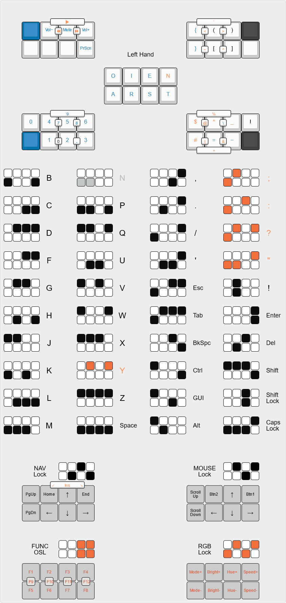

# QMK_KEYMAP

This is my personal *userspace* for [QMK Firmware](https://github.com/qmk/qmk_firmware).

This repo specifically uses [my fork](https://github.com/vunhatchuong/qmk_firmware/tree/master) of QMK on branch master.
Ronny is the legacy branch of this repo.

The `.clang-format` file is a copy of QMK's in my fork master branch.

## QMK Breaking Changes - 2023 May 28 Notes

As of the Breaking Changes - 2023 May 28, combos in a separate file now doesn't work anymore, you have to put it into `keymap.c`.

Combos.def still works.

### Solution

Instead of `SRC+=combo.c`, you can use `INTROSPECTION_KEYMAP_C = combo.c`.

## Custom ARTSEY Colemak

**Currently not able to make layer independent combos so it will conflict with other combos.**

Taken from [purple](https://github.com/purple-rw/artsey-keyboard).

[KLE](http://www.keyboard-layout-editor.com/#/gists/028a856fb6454e3ef3e8c133488c0abd)

## External softwares

- [keymapviz](https://github.com/yskoht/keymapviz) to generate keymap.c ascii art.
  - [keymapviz.ini] is a modified version of [precondition's](https://github.com/precondition/dactyl-manuform-keymap/blob/main/visualisation/keymapviz/keymapviz.ini).

- [keymap-drawer](https://github.com/caksoylar/keymap-drawer) to generate `SVG` images.

## Code Style

All of the code styles files and folders in this repo are from my qmk_firmware fork master branch, this includes:

- [.vscode](./.vscode) folder excludes `c_cpp_properties.json`.
- `c_cpp_properties.json` is from [drashna](https://gist.github.com/drashna/48e2c49ce877be592a1650f91f8473e8).
- [.clang-format](./.clang-format).
