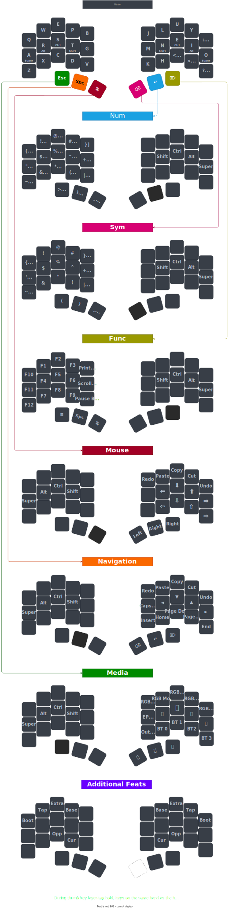

# Ferris Sweep

[KLE](http://www.keyboard-layout-editor.com/#/gists/6824948f0386a8ce1b0be6fef9feabba)



To make your own layout with draw.io.

[Click here](https://viewer.diagrams.net/?tags=%7B%7D&highlight=0000ff&edit=_blank&layers=1&nav=1&title=Keyboard%20Layout.drawio#Uhttps%3A%2F%2Fdrive.google.com%2Fuc%3Fid%3D1-FMiAXGnAvz2rGK0lz8fGDYwmxTp9Ne9%26export%3Ddownload)

Where is the keymap.c?

The keymap.c file is not published to the repository. It is generated from `keymap.json` by the build system.

This avoids duplicating information and allow users to edit their keymap from the qmk configurator web interface.

How do I edit and update the keymap?

The `keymap.json` file is generated from the qmk configurator interface and formatted for better readability in the context of the Ferris keyboard.

To edit it, you may:
* Edit it directly from a text editor.
* Edit it from the qmk configurator.

If you decide to use the latter workflow, here are the steps to follow:

* From the qmk configurator, hit the "import QMK keymap json file" button (it has a drawing with an up arrow on it).
* Browse to the location of your keymap (for example, `<your qmk repo>/keyboards/ferris/keymaps/default/keymap.json`)
* Perform any modification to the keymap in the web UI
* Export the keymap to your downloads folder, by hitting the "Export QMK keymap json file" button (it has a drawing with a down arrow on it)
* Override your original keymap with the output of formatting the exported keymap by running a command such as this one from the root of your qmk repo:
  ```
  ./keyboards/handwired/ferris/keymaps/json2crab.py --input <Your download directory>/default.json > ./keyboards/handwired/ferris/keymaps/default/keymap.json
  ```
  Note that you may first need to make json2crab executable by using `chmod +x` on it.
  Also note that you may then want to remove the exported keymap from your dowload directory.
